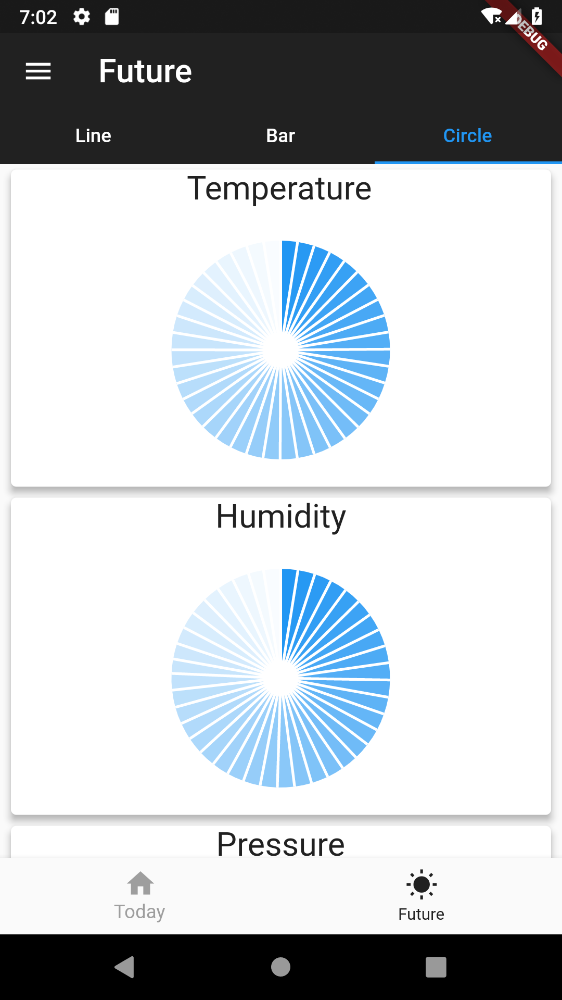
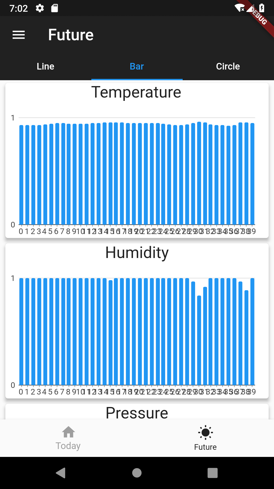

# flutter-chart-http
### :heart: Star :heart: the repo to support the project or :smile:[Follow Me](https://github.com/nb312).Thanks!
Facebook Page | Facebook Group | QQ Group | Developer |
--- | --- | --- | ---
[Flutter Open ](https://www.facebook.com/flutteropen) | [Flutter Open](https://www.facebook.com/groups/948618338674126/) |  963828159 |[NieBin](https://github.com/nb312)
### You can learn: 
1 | 2 | 3 | 4 
--- | --- | --- | ---
Drawer | Json in assets | Http | Line chart |
TabView | Flare animation | EventBus | Bar chart |
|Pie chart | shared_preferences | async | 

  

 
