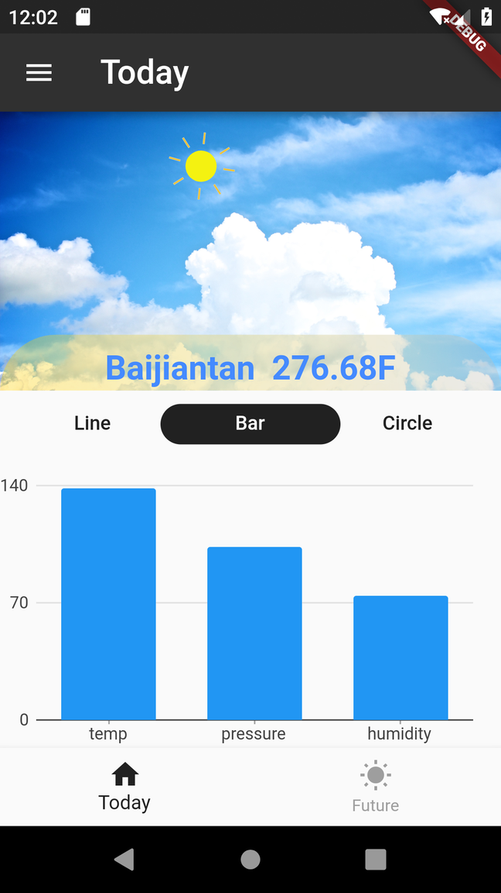
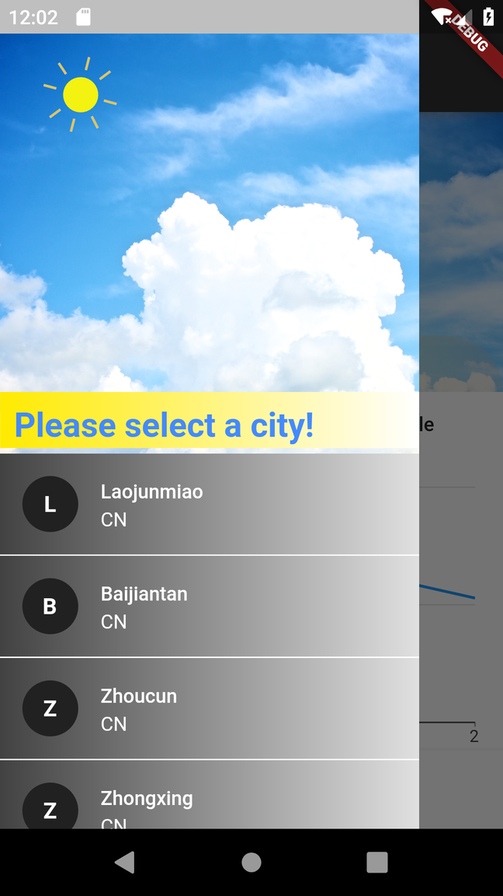
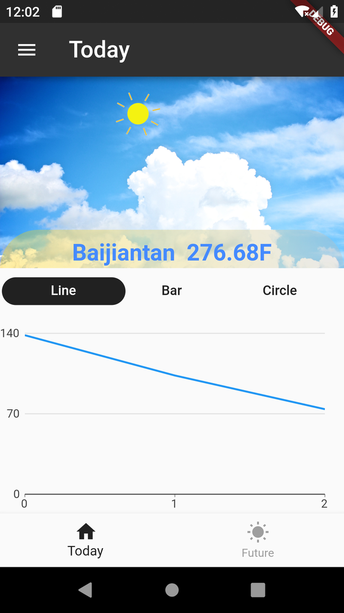

# flutter_weather 
### :heart: Star :heart: the repo to support the project or :smile:[Follow Me](https://github.com/nb312).Thanks!

### You can learn: 
1 | 2 | 3 | 4 
--- | --- | --- | ---
Drawer | Json in assets | Http | Line chart |
TabView | Flare animation | EventBus | Bar chart |
|Pie chart | 

_____
_____

   
